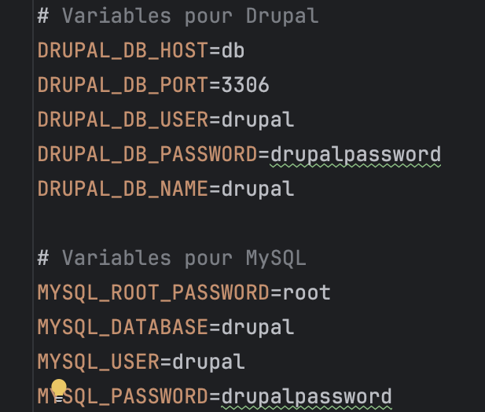
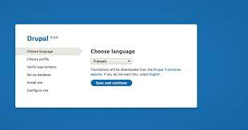
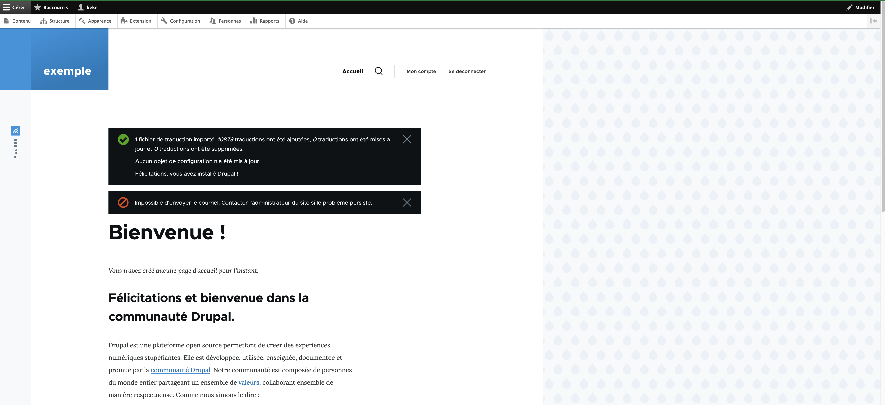

# Drupal

Familiarising yourself with the drupal cms

## Table des matières

- [Installation](#installation)
- [Utilisation](#utilisation)
- [Contribution](#contribution)
- [Licence](#licence)
- [Contact](#contact)

## Prerequisites

Before proceeding with the Drupal installation, ensure the following prerequisites are met:

1. **Docker Installed**: Docker must be installed on your system. Check if Docker is installed with command in your terminal: 
`bash docker --version`

   **If Docker is not installed**, follow the official Docker installation guide for your operating system.

2. **Docker Compose Installed**: Docker Compose is required for managing multi-container Docker applications. 
    It comes pre-installed with Docker Desktop on Windows and Mac, but not for Linux systems, check this website for more informations.

    * **[Overview of installing Docker Compose](https://docs.docker.com/compose/install/)**
 

3. **Composer Installed**: Composer is a dependency manager for PHP and is required for Drupal installation. Check if Composer is installed by running:
`bash composer --version`

    **If Composer is missing**, download and install it according to the instructions on the official Composer website.

Please note that **these prerequisites are essential** for setting up a Drupal installation using Docker containers and 
Composer for dependency management. Make sure to have these tools configured correctly on your system before starting 
the Drupal setup process.

## Installation

1. **Create a new directory** for your Drupal project and navigate into it:
 `bash mkdir my-drupal-site && cd my-drupal-site`

2. Lauch the composer command, for creating a new project: `composer create-project drupal/recommended-project:8.9.5 my-drupal-project`,
   To specify a version of Drupal, replace 8.9.5 with the version you want.

    The command does the following:
    
   * It tells Composer to create a new project.
   * `drupal/recommended-project` package, it's recommended by Drupal for starting new projects.
   * `8.9.5` version of the template is used, is set up with the features and modules compatible with Drupal version 8.9.5.
   * `my-drupal-project` is The new project name.
   * `drupal/recommended-project package` package automatically handle the installation of all dependencies, such as:
     * **Drupal core**, 
     * **contributed modules**, 
     * **libraries**, 
   * the newly created directory named after the project alias (my-drupal-project)
    
   for more information, check **[drupalize.me](https://drupalize.me/tutorial/use-composer-your-drupal-project)**

3. **Create a `.env` file** in the project directory and define the environment variables for your database and Drupal installation:

4. **Create a `docker-compose.yml` file** in the project directory, 
you can check how to do it following my docker-compose in the `docker` folder

5. **Start the Docker containers** by running the following command in the terminal from the project directory:
`bash docker-compose up -d`

6. **Access the Drupal installation** by opening your web browser and navigating to `http://localhost:8080`. 
Follow the prompts to complete the installation, using the credentials from the `.env` file for the database connection.

    >This is what it should look like:
    >
    >
    
7. **Complete the installation** through the Drupal web interface by selecting the installation profile (e.g., Standard), 
entering the database details, and providing the site configuration information.

8. Once the installation is complete, you should see the Drupal welcome screen, indicating that your site is up and running successfully.

   >This is what it should look like:
   >
   >

Remember to replace the placeholders in the `.env` file and `docker-compose.yml` with your actual database credentials and desired configurations. 
After completing these steps, you will have a fully functional local Drupal installation managed by Docker Compose.

## Utilisation

---> soon

---

## References

* [D4Drupal](https://www.youtube.com/@d4drupal324)